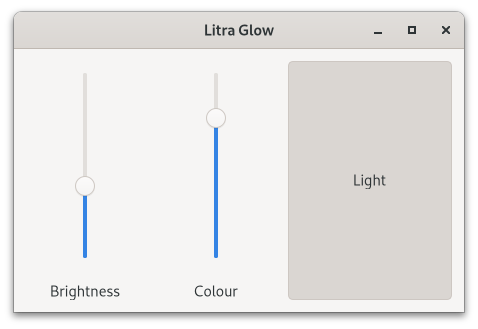

# Litra Glow GTK

An app to control Logitech
[Litra Glow](https://www.logitech.com/en-gb/products/lighting/litra-glow.946-000002.html)
lights.

## Related Projects

[Litra Driver](https://github.com/kharyam/litra-driver) is a Python library and
TK app. I am thankful to the author for discovering the USB protocol used by
Litra Glow.

## Goals

1. Use GTK to fit in with my Fedora desktop.
2. Be available on Flathub for easy install.

## Feature wish list

- Translations into other languages.
- Updating the on screen interface when the values are changed from the physical
  buttons.
- Displaying current values on launch.
- Having an interface to control multiple Litra Glow devices.
